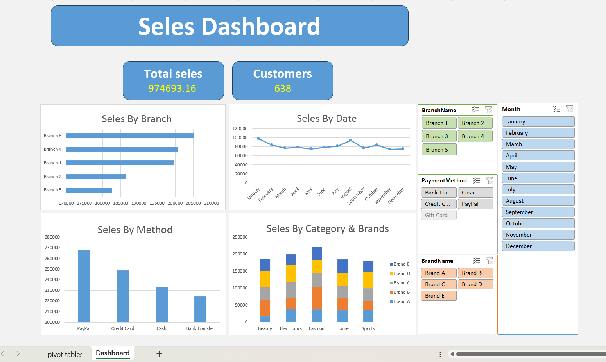

# 🧾 Sales Dashboard (Excel + Power Pivot)

## 🧩 Overview
This interactive **Excel + Power Pivot Dashboard** provides a comprehensive overview of **sales performance** across different branches, payment methods, categories, and brands.  
It combines **Power Pivot data modeling** and **Excel visualizations** to deliver dynamic, slicer-driven insights without the need for external BI tools.

---

## 🚀 Key Metrics
| Metric | Value | Description |
|--------|--------|-------------|
| 💰 **Total Sales** | **974,693.16** | Total revenue generated across all branches. |
| 👥 **Customers** | **638** | Total number of unique customers. |

---

## 🏢 Sales by Branch
| Branch | Performance |
|--------|--------------|
| Branch 3 | Highest sales performance |
| Branch 4 | Strong sales |
| Branch 1 | Competitive performance |
| Branch 2 | Moderate |
| Branch 5 | Lowest |

📊 **Branch 3** leads in sales, indicating strong market performance and consistent customer engagement.

---

## 📅 Sales by Date
A monthly analysis (January–December) showing consistent performance throughout the year,  
with a slight increase in **August**, suggesting seasonal sales influence.

---

## 💳 Sales by Payment Method
| Payment Method | Observation |
|----------------|--------------|
| PayPal | Highest usage |
| Credit Card | 2nd most used |
| Cash | Moderate |
| Bank Transfer | Least used |

💡 Customers prefer **digital payment methods** (PayPal and Credit Card), highlighting the importance of maintaining seamless online payment options.

---

## 🏷️ Sales by Category & Brands
Breakdown of sales by **product category** (Beauty, Electronics, Fashion, Home, Sports) and **brand** (A–E).

**Insights:**
- **Fashion** leads all categories.
- **Beauty** and **Electronics** follow closely.
- **Sales are well distributed across five brands**, reflecting product diversity.

---

## 🧠 Insights Summary
- Branch 3 recorded the **highest total sales**.  
- **PayPal** dominates as the top payment method.  
- **Fashion** is the best-selling category.  
- Monthly performance is stable with minor seasonal peaks.  
- **638 customers** across all branches show solid engagement levels.

---

## 🛠️ Tools & Technologies
- **Microsoft Excel** – Dashboard design, charts, and slicers  
- **Power Pivot** – Data modeling and DAX calculations  
- **Pivot Tables & Charts** – Interactive visuals  
- **Slicers & Filters** – Dynamic data exploration  

---

## 📸 Dashboard Preview

---

## 📎 Author
**Ibrahim Nady**  
Excel & Power Pivot Developer | Data Analysis Enthusiast  
📧 [ibrahimnady.abdelrahman@gmail.com]  
🌐 [www.linkedin.com/in/ibrahim-nady-466b931b6]
